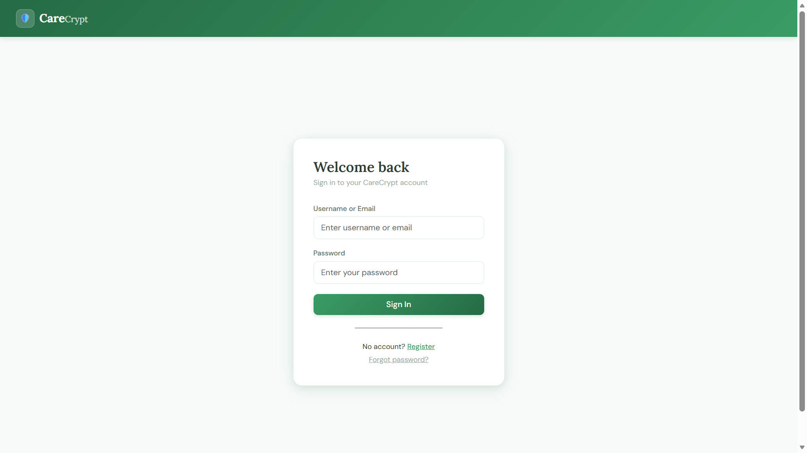
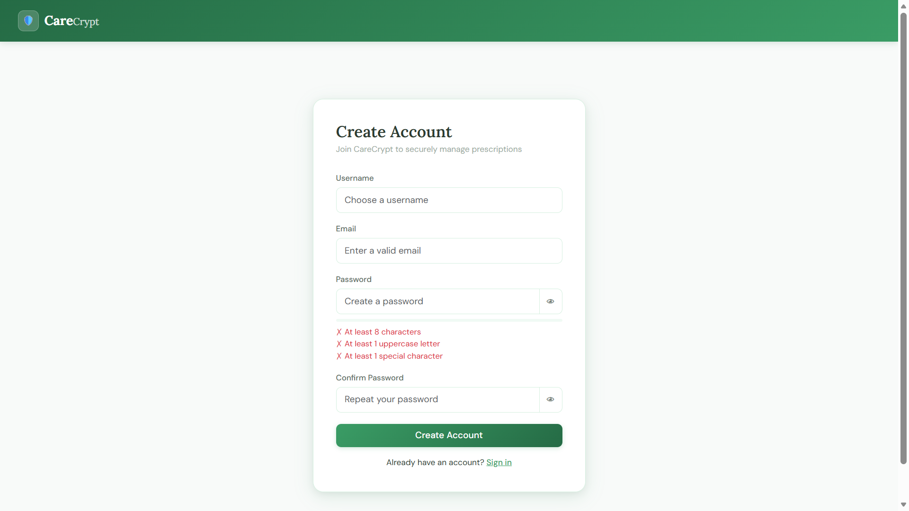
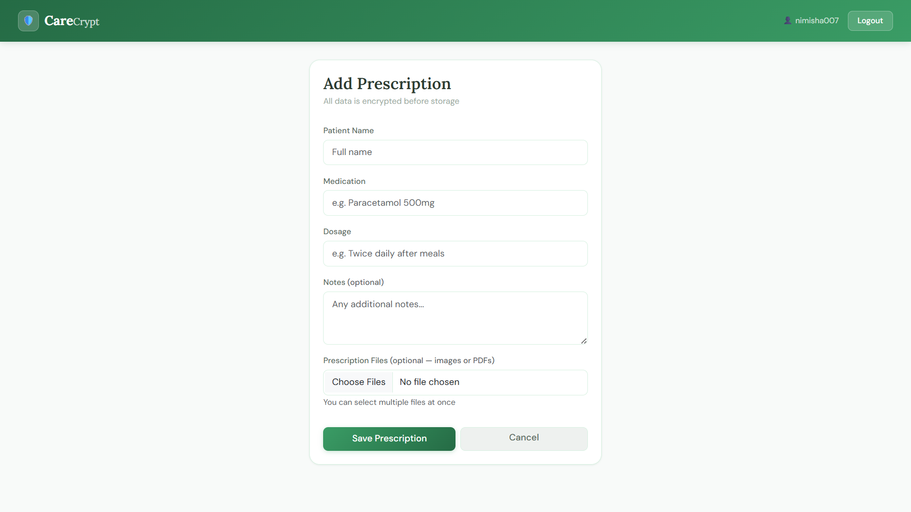
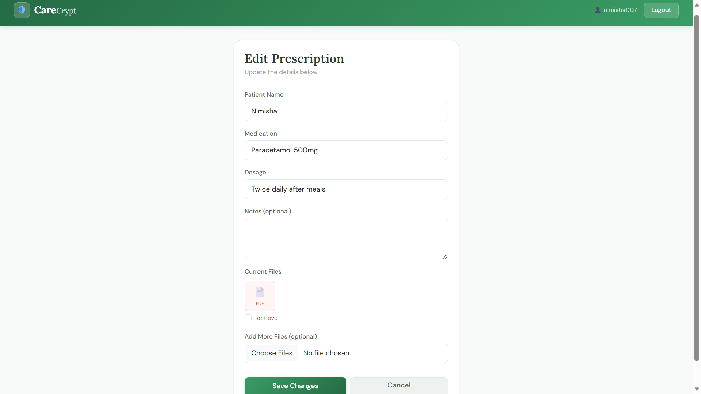
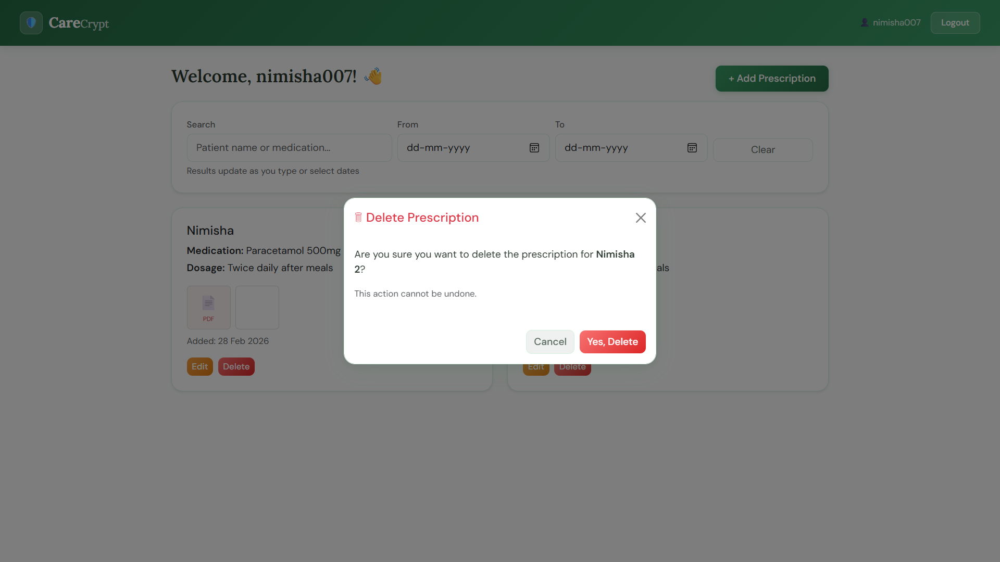
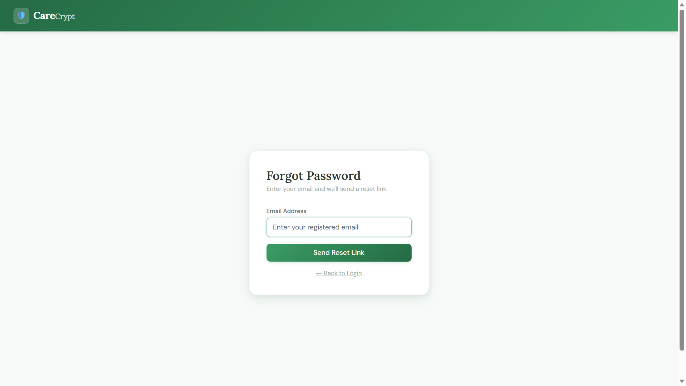
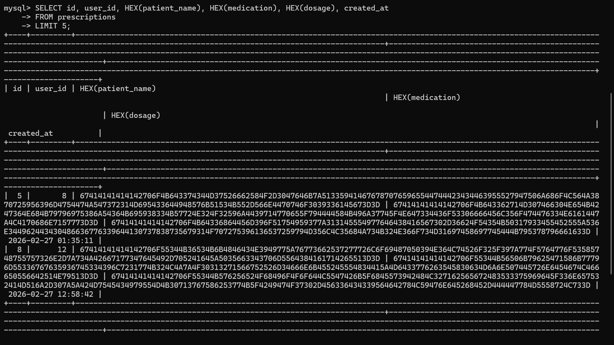
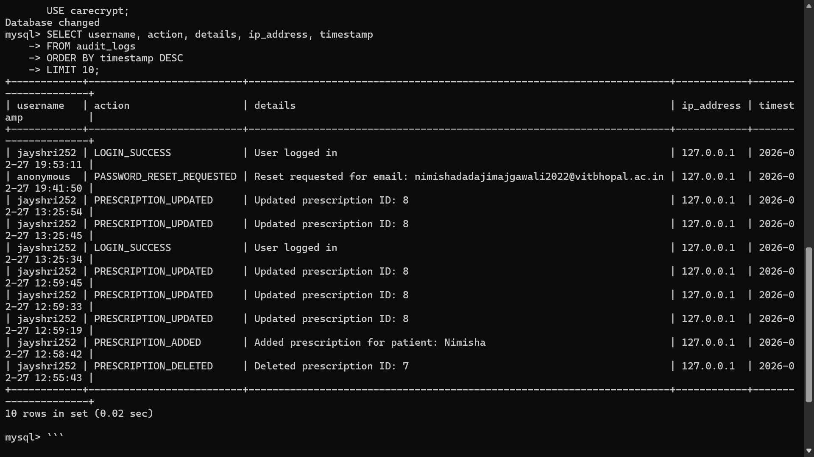

# 🛡️ CareCrypt — Secure Prescription Management

> *Because patient data deserves military-grade protection.*

A full-stack encrypted prescription management system where **every field is AES-128 encrypted before it touches the database** — patient names, medications, dosages, notes, and uploaded files. Built with Flask, secured with Fernet cryptography, containerised with Docker, and deployed on Render.

**🌐 Live App:** https://carecrypt.onrender.com

---

## 🚀 Deployment Status

[](https://carecrypt.onrender.com)
[](https://aiven.io)
[](https://hub.docker.com)
[](https://github.com/nimishaaaaaw/CareCrypt)

---

## ✨ Features

- 🔐 **Field-Level Encryption** — All sensitive data encrypted with Fernet (AES-128 + HMAC) before database storage; raw plaintext never persists
- 📁 **Encrypted File Storage** — Prescription images and PDFs encrypted on disk as `.enc` files, decrypted in-memory on serve — nothing plain ever touches the filesystem
- 🖼️ **Multiple File Uploads** — Upload multiple images/PDFs per prescription with lightbox full-view and PDF icon support
- ✏️ **Full CRUD** — Add, edit, and delete prescriptions with per-image remove controls
- 🔍 **Async Live Search** — 300ms debounced AJAX search by patient name or medication, no page reload
- 📅 **Date Range Filter** — Filter prescriptions between two dates, combinable with text search
- 👤 **Secure Authentication** — Register/login with username or email, bcrypt password hashing, password strength meter
- 🔑 **Forgot Password** — Secure time-limited reset tokens delivered via Gmail SMTP
- 🛡️ **CSRF Protection** — All forms protected with Flask-WTF CSRF tokens
- ⏱️ **Session Timeout** — 15-minute inactivity timeout with a 2-minute warning modal and "Stay Logged In" option
- 🚦 **Rate Limiting** — 5 login attempts per minute, 3 forgot-password requests per minute
- 📋 **Audit Logging** — Every user action (login, register, CRUD, timeout, password reset) logged to a dedicated MySQL table with IP, user ID, and timestamp
- 🐳 **Fully Dockerised** — One-command deployment with Docker Compose

---

## 🛠 Tech Stack

### Backend


### Security


### Frontend


### DevOps & Deployment


---

## 🔐 How Encryption Works

```
User submits form
        ↓
Flask encrypts each field with Fernet key (AES-128 + HMAC-SHA256)
        ↓
Encrypted bytes stored as BLOB in MySQL
        ↓
Files encrypted with encrypt_file() → saved as .enc on disk
        ↓
On retrieval → decrypted in-memory → served to authenticated user only
        ↓
Raw plaintext NEVER persists anywhere
```

The Fernet key lives only in environment variables — never in code or database. Even with full database access, data is unreadable without the key.

---

## 🗄️ Database Schema

```
users                    prescriptions              prescription_images
─────────────────        ──────────────────────     ───────────────────────
id (PK)                  id (PK)                    id (PK)
username (UNIQUE)        user_id (FK → users)       prescription_id (FK)
email (UNIQUE)           patient_name (BLOB)  ←──  filename
password_hash            medication (BLOB)    ←── encrypted  original_ext
created_at               dosage (BLOB)        ←──
                         notes (BLOB)         ←──
audit_logs               image_path                 password_reset_tokens
──────────────           created_at                 ─────────────────────
id (PK)                                             id (PK)
user_id (FK)                                        user_id (FK)
username                                            token (UNIQUE)
action                                              expires_at
details                                             used
ip_address                                          created_at
timestamp
```

---

## 📸 Screenshots

### 🔑 Login


### 📝 Register


### 🏠 Dashboard
.png)

### ➕ Add Prescription


### ✏️ Edit Prescription


### 🗑️ Delete Confirmation


### 🔒 Forgot Password


### 🔐 Encrypted Database


### 📋 Audit Log

---

## 🖥️ Run Locally

### Prerequisites
- Python 3.11+
- MySQL running locally
- Git

### Clone & Setup
```bash
git clone https://github.com/nimishaaaaaw/CareCrypt.git
cd CareCrypt
python -m venv venv
venv\Scripts\activate        # Windows
pip install -r requirements.txt
```

### Configure Environment
Create a `.env` file in the root:
```env
SECRET_KEY=your-secret-key
MYSQL_HOST=localhost
MYSQL_USER=root
MYSQL_PASSWORD=your-mysql-password
MYSQL_DB=carecrypt
MYSQL_PORT=3306
FERNET_KEY=your-fernet-key
MAIL_USERNAME=yourgmail@gmail.com
MAIL_PASSWORD=your-app-password
```

Generate a Fernet key:
```bash
python -c "from cryptography.fernet import Fernet; print(Fernet.generate_key().decode())"
```

### Run
```bash
python run.py
```
Visit `http://127.0.0.1:5000`

---

## 🐳 Docker

```bash
# Build and run everything (Flask + MySQL)
docker compose up --build

# Run in background
docker compose up -d

# Stop
docker compose down

# Stop and remove volumes (fresh DB)
docker compose down -v
```

Visit `http://127.0.0.1:5000`

---

## 🔒 Security Checklist

| Feature | Implementation |
|---|---|
| Password hashing | Bcrypt with salt |
| Data encryption | Fernet AES-128 + HMAC-SHA256 |
| File encryption | Fernet, stored as `.enc`, in-memory decrypt |
| CSRF protection | Flask-WTF on all forms |
| Rate limiting | Flask-Limiter (5/min login, 3/min forgot password) |
| Session timeout | 15 min inactivity, 2 min warning modal |
| SQL injection | Parameterised queries throughout |
| Password reset | Cryptographically secure token, 1hr expiry, single-use |
| Audit trail | All actions logged with IP + timestamp |
| Secrets management | Environment variables only, never in code |

---

## 📌 Future Improvements

- 🏥 Multi-user roles (doctor, patient, admin)
- 📤 Export prescriptions as encrypted PDF
- 📱 Progressive Web App (PWA) for mobile
- 🔔 Expiry reminders for prescriptions
- 🌍 Multi-language support
- 📊 Analytics dashboard for audit logs
- 🔑 Two-factor authentication (2FA)

---

## 👩‍💻 Author

**Nimisha Majgawali**

[](https://github.com/nimishaaaaaw)
